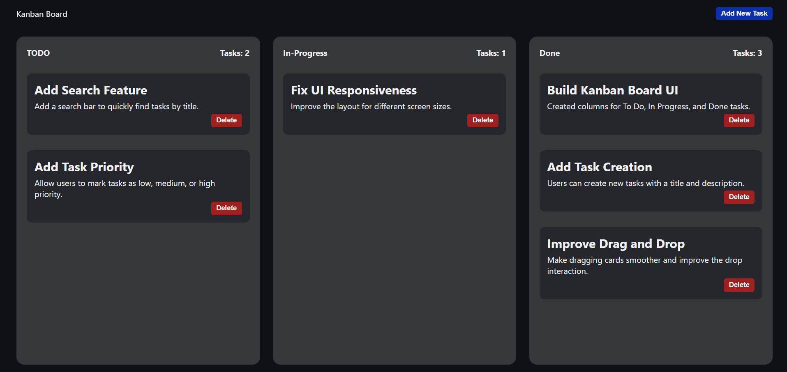
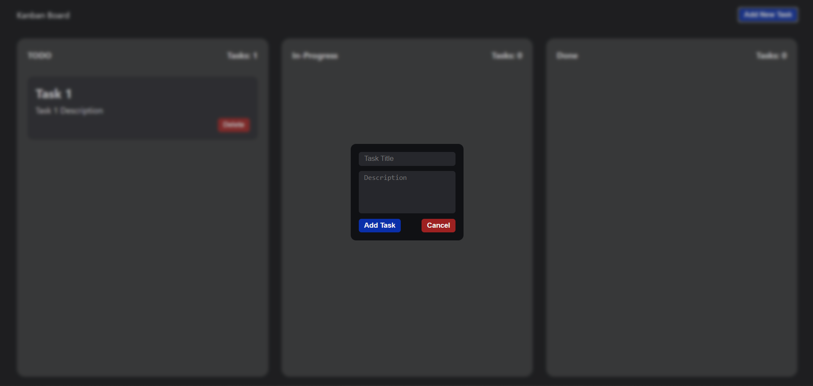

# JavaScript Kanban Board

A simple drag-and-drop Kanban board built with vanilla HTML, CSS, and JavaScript — no frameworks, no libraries.





## ✨ Features

- Create new tasks with a title and description
- Drag and drop tasks between columns (To-Do, In Progress, Done)
- Delete tasks
- Live task count per column
- Data persistence with `localStorage` — tasks survive page reloads
- Fully dynamic task handling (no page reloads needed)

## 🔗 Live Demo

[View Live Demo](https://kanban-board-inky-seven.vercel.app/)

## 🛠️ Built With

- HTML5
- CSS3 (custom properties / CSS variables)
- Vanilla JavaScript (DOM manipulation, event delegation, Drag and Drop API)

## 🚀 Getting Started

Clone the repo and open `index.html` in your browser — no build step required.

```bash
git clone https://github.com/bangarukondabollapally/kanban-board.git
cd kanban-board
```

## 📚 What I Learned

Building this project involved debugging several real-world issues:

- Handling native browser drag-and-drop behavior and ghost images
- Fixing `dragenter`/`dragleave` event bubbling with an enter/leave counter
- Using event delegation so dynamically created tasks stay fully interactive
- Managing state with `localStorage` and keeping the UI in sync
- Avoiding duplicate IDs and understanding DOM scoping with `querySelector`